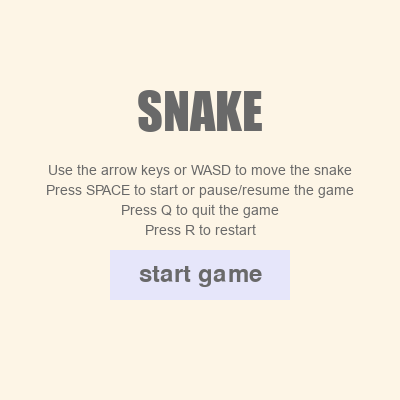
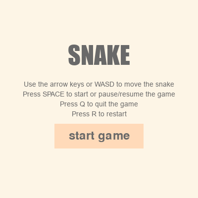
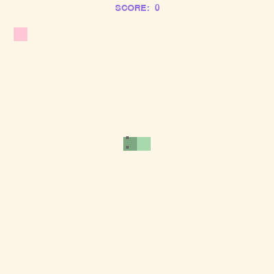
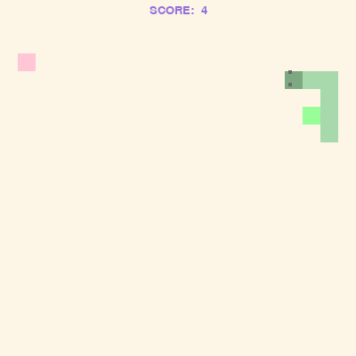
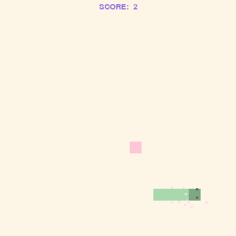
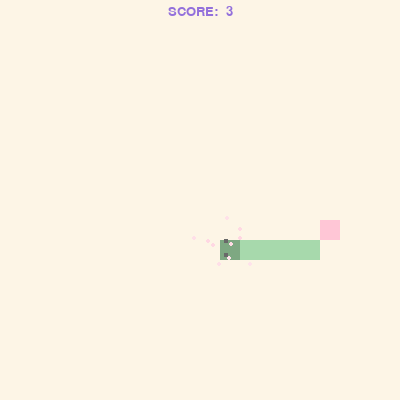
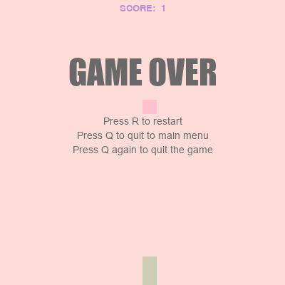
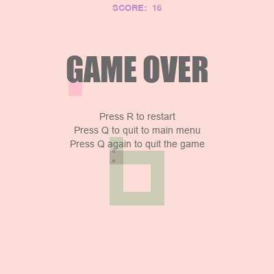
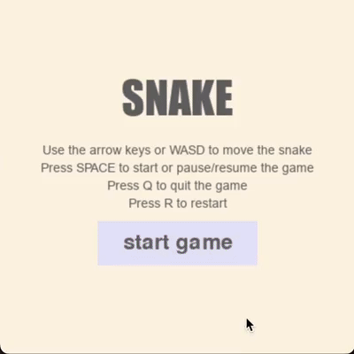
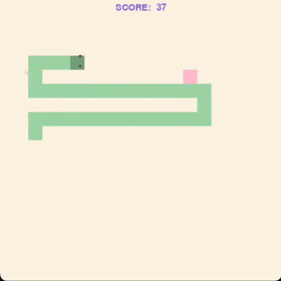

# 🐍 Snake

A classic Snake game built with PyGame - my second game!

## 📑 Table of Contents
- [Quick Start (Just Play)](#-quick-start-just-play)
- [Development Setup](#-development-setup)
  - [Prerequisites](#prerequisites)
  - [Step-by-Step Installation](#step-by-step-installation)
  - [Running the Game](#running-the-game)
  - [Controls](#controls)
- [Project Goals](#-project-goals)
- [Features](#-features)
- [Documentation](#-documentation)
- [What I Learned](#-what-i-learned)
- [First Time Achievements](#-first-time-achievements)
- [Screenshots](#-screenshots)
- [Demo](#-demo)
- [Technical Details](#-technical-details)

## 🎮 Quick Start (Just Play)
Download the game:
- **macOS**: Download `Snake.app` from [Releases](https://github.com/aysieelf/Snake/releases/tag/1.0.0)
  - After downloading, locate Snake.app in Finder. 
  - When opening for the first time:
    - Right-click (or Control-click) on the app and select Open. 
    - In the pop-up dialog, confirm by clicking Open. 
    - This step is necessary because the app is not notarized by Apple. (_and I'm too poor to pay for it_ 😅)
    - Note: First launch might take a few seconds.
  - Afterward, you can open the app normally by double-clicking.

## 🚀 Development Setup
If you want to explore or modify the code:

### Prerequisites
- Python 3.12 or higher
- pip (Python package installer)
- PyGame 2.6.1

To verify your Python installation:
```bash
python --version
pip --version
```

### Step-by-Step Installation
1. Clone the repository:
   ```bash
   git clone https://github.com/aysieelf/Snake.git
   cd Snake
   ```

2. Create and activate a virtual environment (recommended):
   ```bash
   # On Windows
   python -m venv .venv
   .venv\Scripts\activate

   # On macOS/Linux
   python -m venv .venv
   source .venv/bin/activate
   ```

3. Install the required dependencies:
   ```bash
   pip install -r requirements.txt
   ```

### Running the Game
```bash
python main.py
```

### Controls
- WASD/Arrow keys - Move snake
- R - Restart game
- Q - Quit to main menu / Exit game
- Space - Start game / Pause/Resume game

## 🎯 Project Goals
- Create a classic Snake game with smooth controls
- Master PyGame collision detection
- Practice game state management
- Learn grid-based movement systems

## 🚀 Features
- Smooth snake movement with arrow key controls
- Growing snake mechanics
- Score system based on food collection
- Collision detection with walls and self
- Game over & restart functionality
- Pause/Resume game option
- Food spawning system
- Particle effects when collecting food
- Bonus food with special effects

## 📚 Documentation
- [User Guide](docs/user-guide.md) - Detailed instructions on how to play the game

## 📚 What I Learned
- pygame.time.Clock for frame rate control - `pygame.time.Clock.tick()`
  - Used to control the game's speed and ensure consistent performance
- Grid-based movement system implementation
- Collision detection with walls and self
- Game state management patterns
- Pause/Resume game functionality
- Food spawning system with random positioning
- Clean code organization in game development
- Particle system implementation in PyGame
- State management and proper object resetting
- Event handling in PyGame

## 💡 First Time Achievements
- First time implementing a grid-based movement system
- First time using PyGame's `pygame.time.Clock` for frame rate control
- First time implementing a pause/resume game functionality
- First time implementing a food spawning system
- First time implementing a growing snake mechanic
- First time implementing particles in PyGame for effects
- First time handling complex game states

## 📸 Screenshots

### Start Screen



### Gameplay





### Game Over States



## 🎥 Demo



## 🛠️ Technical Details
- Python version: 3.12
- PyGame version: 2.6.1
- Development Platform: PyCharm
- Resolution: 400x400 pixels
- Frame Rate: 60 FPS
- Grid Size: 20x20 cells

---
Part of my [Game Development Journey](https://github.com/aysieelf/Game-Dev-Journey) 🎮